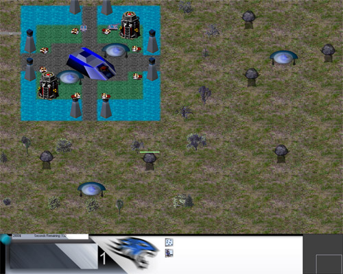



## Rise of Reign \-II Extreme Ways

### Description

[See Screenshot]. Industrial Quality Leading Game in pure VB no DirectX or OpenGL, with Expert Graphics and Extreme Programming, From request of many people RoR-II is here with most fantastic features. Some features are, New and Improved AI, Most creative Map Design, Fantastic Interference, Many new units are included, New Creative Structures, Artistic game theme, spot left on destruction, Storm Improved, Variable AI, New Super Weapons including Ion Cannon and Nuclear Missile. New Sound Track, Textures Support and tons of more features. NOTE : USE THIS GAME COMPILED. Please Vote I have done a lot of hard work for this.
 
### More Info
 

             |
---                |---
**Submitted On**   |2008-08-09 06:11:38
**By**             |[Xelon Labs](https://github.com/Planet-Source-Code/PSCIndex/blob/master/ByAuthor/xelon-labs.md)
**Level**          |Intermediate
**User Rating**    |5.0 (35 globes from 7 users)
**Compatibility**  |VB 6\.0
**Category**       |[Complete Applications](https://github.com/Planet-Source-Code/PSCIndex/blob/master/ByCategory/complete-applications__1-27.md)
**World**          |[Visual Basic](https://github.com/Planet-Source-Code/PSCIndex/blob/master/ByWorld/visual-basic.md)
**Archive File**   |[Rise\_of\_Re212312892008\.zip](https://github.com/Planet-Source-Code/xelon-labs-rise-of-reign-ii-extreme-ways__1-70938/archive/master.zip)

